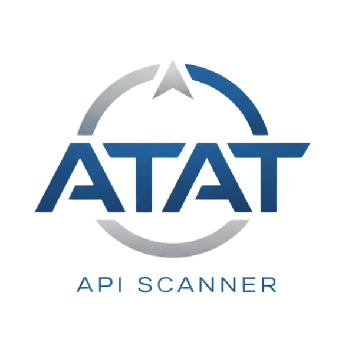

# Skill Issue - API Threat Assessment Tool (AT-AT)

https://www.apithreatassessment.co.za/

**A comprehensive cybersecurity platform designed to automate the security testing of APIs, enabling organizations to identify vulnerabilities early, improve API resilience, and comply with industry security standards.**

---

## 🚀 Project Overview

API Threat Assessment Tool (AT-AT) is an innovative web-based platform that helps secure and test web-based APIs through automated vulnerability scanning, heuristic endpoint discovery, and comprehensive security reporting. Built with scalability and extensibility in mind, AT-AT addresses the critical need for API security in today's digital landscape.

### Key Features
- **Automated Vulnerability Scanning** aligned with OWASP API Security Top 10
- **Multi-format API Import** (OpenAPI/Swagger, Postman Collections)
- **Smart Endpoint Discovery** for undocumented APIs using heuristic exploration
- **Configurable Scan Profiles** (Quick Scan, Comprehensive, Authentication Focus)
- **Professional Security Reports** with actionable remediation guidance
- **Role-Based Access Control** for users and administrators
- **Export Capabilities** (PDF, JSON formats)

---

## 📋 Documentation

### 📖 [Functional Requirements (SRS) Document](https://documentation.at-atdocs.pages.dev/)
Comprehensive Software Requirements Specification detailing functional and non-functional requirements, user stories, technology stack, and system architecture.

### 📊 [GitHub Project Board](https://github.com/COS301-SE-2025/API-Threat-Assessment-Tool/projects)
Track our development progress, sprint planning, and task management through our organized project board.

### 📚 [User Manual](https://drive.google.com/file/d/1nnZuWLJ3689Pkl85kBw2pqISen5tsMIl/view?usp=sharing)
Detailed guide on how to use the API Threat Assessment Tool (AT-AT), including installation, setup, and usage instructions.

### 📥 [Installation Manual](https://documentation.at-atdocs.pages.dev/reference/install)
Step-by-step guide for setting up the API Threat Assessment Tool (AT-AT), covering prerequisites, system setup, and deployment instructions.

### 📝 [Coding Standards](https://documentation.at-atdocs.pages.dev/reference/coding-standards)
Best practices and guidelines for writing clean, maintainable, and secure code for the API Threat Assessment Tool (AT-AT).

---
---
## 🎬 Demo Video

🌟 **See AT-AT in Action!**  
Curious how our API Threat Assessment Tool works?  
Watch our official demo video for a guided walkthrough of all the key features, and powerful security scanning capabilities.

---

## 🛠️ Technology Stack

| Layer | Technology |
|-------|------------|
| **Backend** | Python |
| **Frontend** | React.js |
| **Database** | PostgreSQL |
| **Containerization** | Docker & Kubernetes |
| **Authentication** | OAuth 2.0, JWT |
| **Security Tools** | SQLMap, OWASP ZAP, Burp Suite |
| **Testing** | Pytest, Playwright/Cypress |
| **CI/CD** | GitHub Actions |
| **Documentation** | Markdown + Starlight (Astro) |

---

## 👥 Meet Our Team

### 🔹 [Henru Matthis](https://www.linkedin.com/in/henru-matthis) - Team Leader & Developer
*Full-stack developer with expertise in RESTful API development and security testing*
- **Focus**: Testing & QA, API vulnerability assessment, system resilience
- **Skills**: RESTful APIs, CLI development, security flaw identification
- **GitHub**: [@HenruMatthis](https://github.com/HenruMatthis)

### 🔹 [Salmaan Patel](https://www.linkedin.com/in/salmaan-patel) - Developer
*Computer Science enthusiast passionate about cybersecurity and performance optimization*
- **Focus**: Backend development, API security testing, performance optimization
- **Skills**: C++, Java, JavaScript, Python, React, Node.js, MongoDB, Docker
- **GitHub**: [@SalmaanPatel777](https://github.com/SalmaanPatel777)

### 🔹 [Rhulani Matiane](https://www.linkedin.com/in/rhulani-matiane) - UI/UX Developer
*Human-Computer Interaction specialist focused on intuitive, accessible design*
- **Focus**: User experience design, frontend development, interface optimization
- **Skills**: UI/UX Design, Figma, React, Vue.js, User Research, Accessibility
- **GitHub**: [@Rhulani756](https://github.com/Rhulani756)

### 🔹 [Justin Bhana](https://www.linkedin.com/in/justin-bhana) - Security Specialist & Backend Developer
*Cybersecurity professional with hands-on penetration testing experience*
- **Focus**: Security testing, vulnerability assessment, ethical hacking
- **Certifications**: Google Cybersecurity Professional, API Security (in progress)
- **Skills**: Burp Suite, Metasploit, SQLMap, Python, Rust, Linux/Windows
- **GitHub**: [@DragonMage899](https://github.com/DragonMage899)

### 🔹 [Jacques van der Merwe](http://linkedin.com/in/jacques-van-der-merwe007) - Full-Stack Developer & DevOps
*Infrastructure and development specialist ensuring system scalability*
- **Focus**: Development environments, containerization, system scalability
- **Skills**: Frontend & Backend development, Docker, monitoring & logging
- **GitHub**: [@u22593048](https://github.com/u22593048)

---

## 🎯 Target Audience

- **Internal Security Teams** needing scalable API assessment tools
- **Software Developers** preparing APIs for production deployment
- **Security Analysts** conducting comprehensive API audits
- **Penetration Testers** requiring customizable API testing frameworks
- **University Students** learning collaborative security testing practices

---

## 📈 Project Management

We follow **Agile Scrum methodology** with:
- **2-week sprints** delivering incremental features
- **Daily stand-ups** for progress tracking
- **Sprint reviews** with stakeholder feedback
- **Continuous integration** with automated testing

**Tools**: Github Project Boards (task management), GitHub (version control), Slack (communication)

---

## 🤝 Contributing

We welcome contributions! Please read our [Contributing Guidelines](./CONTRIBUTING.md) and [Code of Conduct](./CODE_OF_CONDUCT.md).

### Development Standards
- Well-organized, modular code with clear separation of concerns
- Descriptive naming conventions and meaningful comments
- Comprehensive testing with unit and integration tests
- Security-first development practices
- Performance optimization and error handling

---

## 📞 Contact & Support

- **Team Email**: [skillissue.capstone@gmail.com](mailto:skillissue.capstone@gmail.com)
- **Issues**: [GitHub Issues](https://github.com/COS301-SE-2025/API-Threat-Assessment-Tool/issues)
- **Discussions**: [GitHub Discussions](https://github.com/COS301-SE-2025/API-Threat-Assessment-Tool/discussions)

---

## 📄 License

This project is licensed under the MIT License - see the [LICENSE](./LICENSE) file for details.

---

## 🏆 Acknowledgments

- **BlueVision ITM** for project sponsorship and guidance
- **University of Pretoria COS301** for academic support
- **BITM** for infrastructure and deployment resources

---
---

## 📂 GitHub Repository Overview

Our repository exemplifies professional software engineering practices, featuring:

### 🧱 Git Structure & Organization
- **Monorepo setup** combining frontend, backend, and documentation for streamlined development
- Modular directory layout promoting clear separation of concerns and ease of navigation

### 🌿 Branching Strategy
- **Main branches:** `dev` for active development, `feature/*` for individual features, and `documentation` for docs updates
- Regular **merges via pull requests** with code reviews to ensure quality and collaboration

### 📊 Code Quality Badges
Our GitHub repository proudly displays real-time badges showcasing project health and quality metrics:

| Badge Type          | Tool / Service      | Purpose                                  |
|---------------------|--------------------|------------------------------------------|
| **Code Coverage**   | Coveralls / Codecov | Tracks test coverage percentages          |
| **Build Status**    | GitHub Actions      | Continuous Integration build health       |
| **Requirements**   | shields.io          | Dependency status and security updates    |
| **Issue Tracking** | GitHub Issues       | Open and resolved issue tracking          |
| **Monitoring**     | NodePing / Uptime Robot | Service uptime and availability monitoring |

### Badge Display Example

---

**Built with ❤️ by Team Skill Issue**

*Securing APIs, One Scan at a Time* 🛡️

